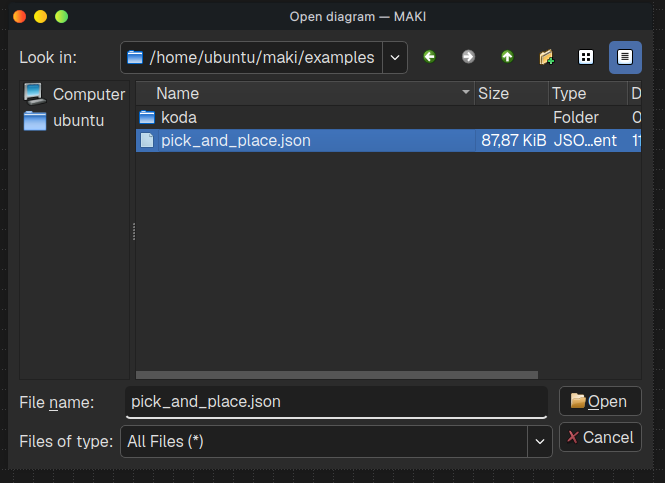

# 2026-LArc-Replication-Package

Instructions and the necessary code to replicate the case study of the paper ["Verification-Centered Low-Code for Autonomous Robots"](https://doi.org/10.1145/3786179.3788321)

The experiments were executed in laptop with:

- OS: Ubuntu 24.04
- Kernel: 6.8.0-100-generic
- Arch: x86_64

# Installation steps

1. Clone this repository.
```bash
git clone https://github.com/FelipeACXavier/2026-LArc-Replication-Package.git
cd 2026-LArc-Replication-Package
```

2. Make sure you have a ros2 folder in your home folder
```bash
mkdir ~/ros2_ws
```

3. Ensure the necessary simulations files are present in the ROS workspace"
```bash
cp aruco* ~/ros2_ws
cp turtlebot3_world_map* ~/ros2_ws
```

4. Clone the MAKI repository
```bash
git clone https://github.com/FelipeACXavier/maki.git
```

5. Install the docker container provided in the repository, this will contain:
  - Ubuntu 22.04
  - Environment to build MAKI
  - ROS 2 Humble with the packages necessary for the study
```bash
cd maki
docker build . \
  --build-arg USERNAME=$(id -un) \
  -f docker/maki_with_ros \
  -t maki_ros:v1.0.0
```
_Note: Creating the docker container might take some time_

6. Enter the docker container:
```bash
docker run -it \
  --name maki_ros \
  --user 1000:1000 \
  --net=host \
  -e DISPLAY=:0 \
  -e QT_X11_NO_MITSHM=1 \
  --device /dev/dri \
  -v /tmp/.X11-unix:/tmp/.X11-unix:rw \
  -v ~/ros2_ws:/home/$(id -un)/ros2_ws:rw \
  -v .:/home/$(id -un)/maki:rw \
  maki_ros:v1.0.0
```
7. Build MAKI:
```bash
./scripts/linux/build.sh --release
```

# Running steps

1. Run MAKI. (Inside the docker)

```bash
./release/linux/bin/maki
```
2. Open one of the `pick_and_place.json` example files. The specific path my vary, but the examples are located in `maki/examples`.

<p align="center"></p>

3. Run the verification.

<p align="center"></p>

4. Run the simulation.

<p align="center"></p>

5. To execute the ROS nodes (Sadly these steps must still be done manually for now):
  
  - 5.1 - Run the generator to convert the dezyne code to C++ and compile the ROS files.

```bash
  ~/KODA/helpers/build_ros --project ./release/linux/bin/maki/generated/KODA/ --name pickandplace
```
  - 5.2 - Execute the necessary nodes in four different terminals (inside the docker):
    
    - The moveit package for arm control in simulation:
    
    ```bash
    cd ros2_ws && source install/setup.bash && ros2 launch turtlebot3_manipulation_moveit_config move_group.launch.py
    ```
    
    - The gazebo simulator:
    
    ```bash
    cd ros2_ws && source install/setup.bash && ros2 launch turtlebot3_manipulation_gazebo gazebo.launch.py world:=./aruco_world.world use_sim_time:=true
    ```

    - The navigation package for simulation: 
    
    ```bash
    cd ros2_ws && source install/setup.bash && ros2 launch turtlebot3_navigation2 navigation2.launch.py use_sim_time:=true map:=./turtlebot3_world_map.yaml
    ````

    - The generated orchestration node: 
    
    ```bash
    cd ros2_ws && source install/setup.bash && ros2 launch pickanddrop default.launch.py
    ```